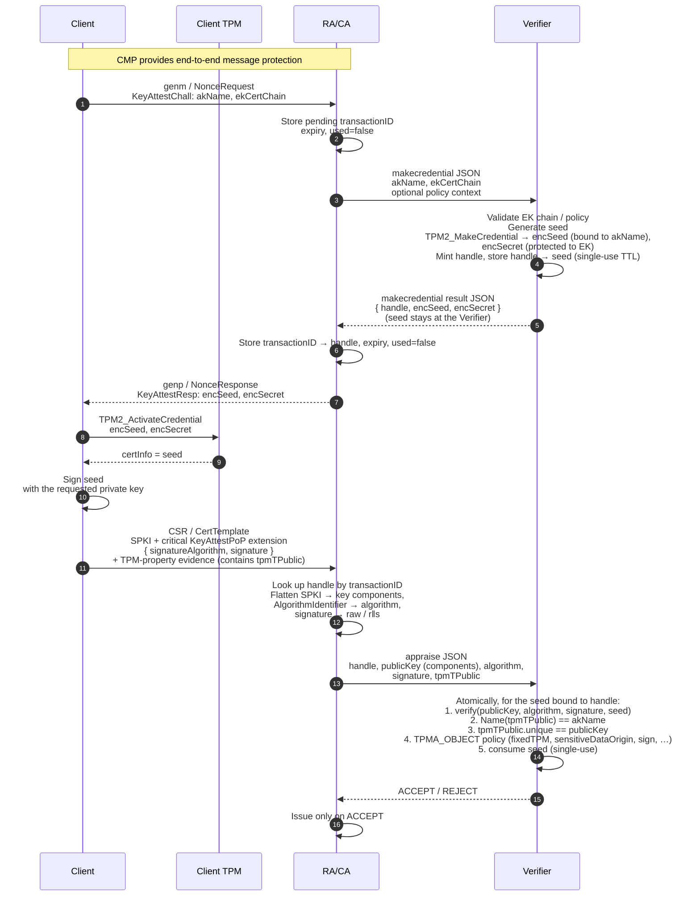

# Key Attestation Structures — v5 verifier-delegated MakeCredential

ASN.1 definitions and workflow description for a CMP-carried key-attestation
exchange between a **client**, a **Relying Party / CA/RA**, and an external
**Verifier**.

This version uses a **challenge-bound proof-of-possession** design with a clean
separation of duties: the **Verifier** owns all TPM logic (it performs
`TPM2_MakeCredential`, holds the `seed`, and later verifies the proof), while the
**CA/RA** owns all ASN.1 / X.509 / CMP logic (it parses the CSR / `CertTemplate`
and the `KeyAttestPoP` extension and forwards cryptographic primitives). Neither
side needs to understand the other's domain.

1. The **client** sends a `KeyAttestChall`, providing the TPM Name of the
   Attestation Key / requested key (`akName`) and the TPM Endorsement Key (EK)
   certificate chain. The full `TPMT_PUBLIC` of the key is not needed for
   challenge construction; it is provided later to the Verifier as part of the
   TPM-property evidence.
2. The **CA/RA** forwards only `akName` (the TPM Name of the new key) and the EK
   certificate chain to the **Verifier**, optionally with local policy context.
   It does **not** send the CMP `transactionID` to the Verifier. The CA/RA does
   not parse TPM public areas, implement `TPM2_MakeCredential`, or understand TPM
   credential protection internals.
3. The **Verifier** validates the EK / policy inputs, generates a fresh
   high-entropy `seed`, and executes `TPM2_MakeCredential` (or an equivalent
   software construction). It mints a fresh single-use **transaction handle**,
   stores the `seed` in Verifier-side state keyed by that handle, and returns
   `{ handle, encSeed, encSecret }` to the CA/RA. **The `seed` never leaves the
   Verifier.** `encSeed` (the credential blob) is bound to `akName`; `encSecret`
   protects the TPM protocol secret to the EK public key.
4. The **CA/RA** records the mapping `transactionID → handle` in its protected
   state and sends only `encSeed` and `encSecret` to the client in
   `KeyAttestResp`. Neither the `seed` nor the `handle` is sent to the client.
5. The **client TPM** runs `TPM2_ActivateCredential`. If activation succeeds,
   the TPM returns the decrypted credential value as `certInfo`. In this
   profile, `certInfo` is the Verifier-generated `seed`.
6. The **client** signs the recovered `seed` with the requested private key and
   places the resulting signature, together with its `AlgorithmIdentifier`, into
   a private critical CSR / `CertTemplate` extension named `KeyAttestPoP`.
7. The **CA/RA** extracts from the CSR / `CertTemplate` the requested public key,
   the signature algorithm, and the signature; **flattens them into cryptographic
   primitives** (numeric public-key components, an algorithm identifier, and the
   raw / normalized signature — see [Verifier JSON interface](#verifier-json-interface));
   and sends them, together with the `handle` and the client's `tpmTPublic`, to
   the Verifier in a single **appraise** request. The CA/RA performs **no** TPM
   logic and **no** cryptographic PoP verification itself.
8. The **Verifier** looks up the `seed` by `handle` and, in one **atomic**
   appraisal, (a) verifies the PoP signature over the stored `seed`, (b)
   recomputes `Name(tpmTPublic)` and checks it equals `akName`, (c) checks the
   requested public key equals `tpmTPublic.unique`, (d) checks the required
   `TPMA_OBJECT` attributes, and (e) consumes the `seed` (single-use). It returns
   a single ACCEPT / REJECT verdict. The Verifier never parses the CSR, the X.509
   extension, an `AlgorithmIdentifier`, a `SubjectPublicKeyInfo`, or a DER
   signature — it operates on cryptographic primitives only.

The older `TPM2_Certify`-statement logic is intentionally not used here. The
private extension is not a TPM attestation statement; it is a compact proof that
the key requested in the CSR / `CertTemplate` could sign a secret that was only
released after successful TPM credential activation.

This profile is therefore intended for requested keys that can produce an
ordinary proof-of-possession signature over external challenge data. If the key
profile requires a restricted attestation key, or a key that cannot sign the
`seed` with the requested `AlgorithmIdentifier`, a TPM-generated attestation
statement such as `TPM2_Certify` is the more appropriate evidence format.

## Terminology

Three distinct values are easy to conflate; they are kept separate throughout
this document:

- **`nonce`** — the `OCTET STRING` field of `NonceResponse` (and the length hint
  in `NonceRequest`). This is the generic CMP challenge nonce of the shared
  general-message envelope. In a `TPM2_Quote` / `TPM2_Certify` attestation flow
  it is the value the TPM copies into `TPMS_ATTEST.extraData` (`qualifyingData`).
  In *this* `KeyAttestPoP` flow there is no Quote, so the `nonce` field carries
  only an optional CA/RA challenge nonce (it may be empty) and is **not** the
  proof-of-possession value.
- **`seed`** — the Verifier-generated, high-entropy, single-use credential value
  passed to `TPM2_MakeCredential`, recovered by the client as `certInfo` from
  `TPM2_ActivateCredential`, and signed for the proof of possession. The `seed`
  plays the freshness role that `qualifyingData` plays in a Quote flow. It is
  the plaintext credential value, distinct from the `nonce` field above.
- **TPM protocol seed** — the random value the TPM's MakeCredential construction
  encrypts to the EK and carries inside `encSecret` (`TPM2B_ENCRYPTED_SECRET`).
  This is an internal TPM artifact, never surfaced to the CA/RA, and is *not* the
  same value as the `seed` credential above despite the shared word.

**`handle`** is the Verifier-minted, single-use identifier that links the
Verifier's two calls (`makecredential`, then `appraise`) and keys its stored
`seed`. It is independent of the CMP `transactionID`, which stays private to the
CA/RA.

## v5 design change from v4

The important design change is the placement of responsibilities:

- v4: the CA/RA validated enough TPM material to call `TPM2_MakeCredential`
  itself, produced `credentialBlob` / `encSecret`, and verified the proof of
  possession.
- v5: the CA/RA delegates **both** MakeCredential **and** proof-of-possession
  verification to the Verifier. The Verifier holds the `seed` (it is never
  returned to the CA/RA) and performs one atomic appraisal that fuses the PoP
  signature check with the TPM-property checks. The CA/RA only translates ASN.1
  into cryptographic primitives and forwards them.

This keeps TPM parsing, EK handling, MakeCredential, and signature verification
inside the Verifier, and keeps all X.509 / CMP / CRMF / PKCS#10 parsing inside
the CA/RA. The CA/RA only needs to:

- preserve protected CMP transaction state and the `transactionID → handle` map,
- forward the client's `KeyAttestChall` (`akName`, `ekCertChain`) to the Verifier,
- deliver `encSeed` / `encSecret` to the client, and
- extract the SPKI, signature algorithm, and signature from the CSR /
  `CertTemplate`, flatten them to primitives, and forward them with the `handle`
  and `tpmTPublic` for the Verifier to appraise.

The Verifier needs no ASN.1 of the requested certificate or the `KeyAttestPoP`
extension. (It still parses the EK certificate chain at MakeCredential time to
obtain the EK public key; that is treated as part of its TPM / endorsement trust
role, not as PKIX profile logic for the requested certificate.)

## Workflow overview



## CMP certificate-request workflow (general messages)

The challenge/response exchange is not a standalone protocol. It is carried
inside RFC 4210 / RFC 9810 **CMP general messages**. CMP provides two message
bodies for this purpose:

- `genm` (`GenMsgContent`, client → server), and
- `genp` (`GenRepContent`, server → client).

Both are `SEQUENCE OF InfoTypeAndValue`, the standard CMP container that pairs
an OID with an OID-defined value:

```asn1
-- Standard CMP structure shown for context; not redefined by this profile.
InfoTypeAndValue ::= SEQUENCE {
    infoType    OBJECT IDENTIFIER,
    infoValue   ANY DEFINED BY infoType OPTIONAL
}
```

Two `infoType` OIDs carry the challenge exchange. The client sends a
`NonceRequestValue` in a `genm` under `id-it-nonceRequest`; the CA/RA replies
with a `NonceResponseValue` in a `genp` under `id-it-nonceResponse`. This round
trip runs before, or alongside, the actual certificate request (`ir` / `cr` /
`kur` / `p10cr`). The proof generated from the challenge is then returned in
that certificate request as the private critical `KeyAttestPoP` extension.

```asn1
-- InfoType OIDs for the CMP general-message nonce/challenge exchange.
-- NOTE: these are custom/private values (8888/8889); replace with
-- registered OIDs before interoperability use.
id-it-nonceRequest  OBJECT IDENTIFIER ::= { 1 2 840 113549 1 9 16 2 8888 }
id-it-nonceResponse OBJECT IDENTIFIER ::= { 1 2 840 113549 1 9 16 2 8889 }

-- Payload OIDs used in NonceRequest.type and NonceResponse.type.
-- PLACEHOLDER: replace with OIDs from your own PEN / PKIX arc.
id-keyAttestChall OBJECT IDENTIFIER ::= { 1 3 6 1 4 1 <PEN> 1 1 }
id-keyAttestResp  OBJECT IDENTIFIER ::= { 1 3 6 1 4 1 <PEN> 1 2 }

-- Sent by the client inside genm. For the KeyAttest proof-of-possession
-- flow, reqInfo contains DER(KeyAttestChall) and type is id-keyAttestChall.
NonceRequest ::= SEQUENCE {
   len INTEGER (8..64) OPTIONAL,
   type ATTESTATION-NONCE-REQUEST.&id(
      {AttestationNonceRequestSet}) OPTIONAL,
   reqInfo ATTESTATION-NONCE-REQUEST.&Type(
      {AttestationNonceRequestSet}{@type}) OPTIONAL
}

NonceRequestValue ::= SEQUENCE SIZE (1..MAX) OF NonceRequest

-- Returned by the CA/RA inside genp. For this profile, nonce can be empty or
-- carry a CA/RA nonce for the CMP challenge context. The TPM activation
-- material is carried in respInfo as DER(KeyAttestResp), and type is
-- id-keyAttestResp.
NonceResponse ::= SEQUENCE {
   nonce OCTET STRING (SIZE(0 | 8..64)),
   expiry INTEGER OPTIONAL,
   type ATTESTATION-NONCE-RESPONSE.&id(
      {AttestationNonceResponseSet}) OPTIONAL,
   respInfo ATTESTATION-NONCE-RESPONSE.&Type(
      {AttestationNonceResponseSet}{@type}) OPTIONAL
}

NonceResponseValue ::= SEQUENCE SIZE (1..MAX) OF NonceResponse
```

For this profile, the `genm` / `genp` pair is only the transport envelope:

```text
genm / NonceRequest:
  type    = id-keyAttestChall
  reqInfo = DER(KeyAttestChall { akName, ekCertChain })

genp / NonceResponse:
  nonce   = caNonce or empty, according to local freshness policy
  type    = id-keyAttestResp
  respInfo = DER(KeyAttestResp { encSeed, encSecret })
```

`NonceRequest` and `NonceResponse` are a generic, reusable nonce container, so
all of their fields are marked `OPTIONAL` in ASN.1. For *this* profile the
following conformance constraints apply: `NonceRequest.type` and
`NonceRequest.reqInfo` MUST be present, and `NonceResponse.type` and
`NonceResponse.respInfo` MUST be present. `NonceRequest.len` and
`NonceResponse.expiry` are not used by this profile — expiry is tracked in CA/RA
state, not on the wire. The `NonceResponse.nonce` field is the CMP challenge
nonce (see [Terminology](#terminology)); it is a different value from the `seed`
and may be empty in this flow.

The CA/RA stores the CMP `transactionID` as the server-side correlation key for
the pending challenge state, mapping it to the Verifier-minted `handle`:

```text
transactionID → handle, expiry, used=false
```

The CA/RA never stores the `seed`; the Verifier holds it. Because CMP already
provides end-to-end protection, the `transactionID` does not need to be included
in the `KeyAttestPoP` extension or signed by the new key. The CA/RA binds the
proof to the CMP exchange through its protected CMP state and single-use
challenge validation. Including the `transactionID` (or `handle`) in the signed
input would mainly provide defense-in-depth for detached verification, auditing,
or implementation-error detection.

If a single CMP transaction carries more than one key-attestation challenge, the
CA/RA state MUST be indexed more precisely, for example by
`transactionID || akName` or by the per-challenge `handle`. Because each
`handle` is Verifier-minted and single-use, the Verifier's stored `seed` cannot
collide across concurrent challenges. The CA/RA must never submit a
`KeyAttestPoP` against a different pending `handle` than the one whose
`KeyAttestResp` produced it.

## Verifier JSON interface

The Verifier exposes two synchronous JSON endpoints. The exact HTTP paths are
deployment-specific; the data contracts are below. Both calls carry only
cryptographic primitives and opaque TPM byte strings — never X.509, CMP, CRMF,
or PKCS#10 ASN.1 — so the Verifier needs no ASN.1 parser for the requested
certificate. (The Verifier does parse the EK certificate chain to obtain the EK
public key; that is part of its TPM / endorsement trust role.)

The CA/RA ↔ Verifier channel MUST provide server authentication, integrity,
confidentiality, and replay protection: it gates access to the `seed` (via the
`handle`) and carries the algorithm the Verifier enforces.

### 1. `makecredential`  (CA/RA → Verifier)

A synchronous, blocking, 1:1 RPC: the CA/RA correlates the response to its
pending state by call-return. The request carries only the TPM information the
CA/RA received from the client, plus optional policy. `akName` and each
`ekCertChain` entry are opaque byte strings the CA/RA forwards without parsing.

```json
{
  "akName": "hex-encoded TPM Name bytes",
  "ekCertChain": ["hex-encoded DER certificate", "..."],
  "policy": { "profile": "optional issuing profile name" }
}
```

The Verifier generates a fresh `seed`, runs `TPM2_MakeCredential`, mints a fresh
single-use `handle`, stores `handle → { seed, akName, expiry, used=false }`, and
returns:

```json
{
  "handle": "verifier-minted single-use transaction handle (opaque)",
  "encSeed": "hex-encoded TPM2B_ID_OBJECT (credential blob)",
  "encSecret": "hex-encoded TPM2B_ENCRYPTED_SECRET"
}
```

The `seed` is **not** in the response — it never leaves the Verifier. The CA/RA
maps its CMP `transactionID → handle`, copies `encSeed` / `encSecret` verbatim
into `KeyAttestResp`, and forwards them to the client. `encSeed` / `encSecret`
remain opaque TPM byte strings to the CA/RA.

### 2. `appraise`  (CA/RA → Verifier)

After the CSR / `CertTemplate` arrives, the CA/RA performs all ASN.1
decomposition on its own side and sends the Verifier only primitives. The
Verifier never sees a `SubjectPublicKeyInfo`, an `AlgorithmIdentifier`, or a DER
signature.

```json
{
  "handle": "the handle returned by makecredential",
  "publicKey": { "kty": "RSA", "n": "hex modulus", "e": "hex exponent" },
  "algorithm": "RSASSA_PKCS1_V15_SHA256",
  "signature": "hex raw signature bytes",
  "tpmTPublic": "hex-encoded TPM-marshalled TPMT_PUBLIC"
}
```

Public-key forms — JWK-shaped numeric components, never SPKI DER:

```text
RSA : { "kty":"RSA", "n":"<modulus hex, big-endian>", "e":"<exponent hex>" }
EC  : { "kty":"EC", "crv":"P-256"|"P-384"|"P-521", "x":"<coord hex>", "y":"<coord hex>" }
```

`algorithm` is a closed enum that fully determines hash, padding, and signature
encoding, so the Verifier never inspects `AlgorithmIdentifier` parameters. This
profile defines exactly two values (matching the implemented algorithms; extend
per profile if a deployment needs more):

```text
RSASSA_PKCS1_V15_SHA256   (OID 1.2.840.113549.1.1.11) → RSA PKCS#1 v1.5, SHA-256
ECDSA_SHA256              (OID 1.2.840.10045.4.3.2)    → ECDSA, SHA-256, sig = r‖s
```

The CA/RA owns the `AlgorithmIdentifier` → enum mapping. RSA signatures are a
flat octet string, forwarded as raw hex. **ECDSA** signatures arrive in the CSR
as a DER `SEQUENCE { r, s }`; the CA/RA decodes them and re-emits fixed-width
big-endian `r‖s` (2·⌈curveBits/8⌉ bytes), so the Verifier slices by length and
never DER-decodes a signature. An unknown `algorithm`, or one that does not match
`publicKey.kty`, is rejected.

The Verifier returns one fused verdict (see
[Verifier appraisal](#verifier-appraisal)):

```json
{ "handle": "the handle", "accepted": true, "reason": "ok" }
```

On `accepted:false`, `reason` is a machine code such as `signature_invalid`,
`unknown_or_expired_handle`, `seed_already_used`, `unsupported_algorithm`,
`name_mismatch`, `public_key_mismatch`, or `attribute_policy_failed`.

## KeyAttestChall

Sent by the **client** to the **CA/RA** in the CMP `genm` request. It carries
only the information the Verifier needs to construct the credential-activation
challenge: the TPM Name of the key to be certified and the EK certificate chain.
The CA/RA forwards this structure, or its decoded JSON equivalent, to the
Verifier.

The full `TPMT_PUBLIC` of the key is deliberately not duplicated here. It is
already carried later in the TPM-property attestation/evidence statement sent to
the Verifier. Before certificate issuance, the Verifier MUST recompute the TPM
Name from that `TPMT_PUBLIC` and compare it to the `akName` used in
`TPM2_MakeCredential`.

```asn1
KeyAttestChall ::= SEQUENCE {
    -- TPM Name of the Attestation Key / requested key being attested.
    --
    -- For a TPM 2.0 object, the Name has the form:
    --
    --   nameAlg || H_nameAlg(TPMT_PUBLIC)
    --
    -- where nameAlg is the two-byte TPM_ALG_ID from the object's TPMT_PUBLIC
    -- and the digest is computed over the TPM-marshalled TPMT_PUBLIC.
    -- For SHA-256, this produces 2 + 32 = 34 bytes.
    --
    -- The Verifier uses this value as the objectName input when creating the
    -- TPM2_MakeCredential output. A Verifier later receives TPMT_PUBLIC as
    -- part of the attestation/evidence input, recomputes the Name, and checks
    -- that it equals this value.
    akName          OCTET STRING,

    -- Certificate chain for the TPM Endorsement Key, typically leaf-first:
    -- EK certificate, issuing CA certificates, and optionally up to a trust
    -- anchor. The Verifier obtains the EK public key from the leaf certificate
    -- and uses it as the credential-protection key for TPM2_MakeCredential.
    ekCertChain     SEQUENCE OF Certificate
}
```

## KeyAttestResp

Returned by the **CA/RA** in the CMP `genp` response. It contains the two opaque
TPM byte strings that the Verifier produced and that the client TPM consumes via
`TPM2_ActivateCredential`.

The Verifier generates a high-entropy, single-use `seed` and passes it as the
credential value to `TPM2_MakeCredential` or to an equivalent software
implementation of the MakeCredential construction. The value must fit into the
TPM `TPM2B_DIGEST` credential size accepted by `TPM2_MakeCredential`; for
interoperability it should be no larger than the digest size of the `nameAlg` of
the credential-protection key, e.g. 32 bytes for a SHA-256 EK. The resulting
`encSeed` is bound to `akName`; the `encSecret` protects the internal seed to
the TPM-resident EK or another approved restricted decryption/storage key.

```asn1
KeyAttestResp ::= SEQUENCE {
    -- The TPM credential blob / encrypted credential value produced by
    -- TPM2_MakeCredential and consumed by TPM2_ActivateCredential. This was
    -- named credentialBlob in v4. This v5 profile names the field encSeed
    -- because the recovered plaintext credential is the Verifier-generated
    -- seed used for PoP verification.
    --
    -- Structurally, TPM2B_ID_OBJECT wraps a TPMS_ID_OBJECT:
    --
    --   integrityHMAC || encIdentity
    --
    -- integrityHMAC is a TPM2B_DIGEST. encIdentity is the encrypted credential
    -- value. The encrypted value is the complete marshalled TPM2B_DIGEST
    -- credential value; its size field is encrypted as well.
    --
    -- This protocol treats encSeed as opaque TPM data. It is carried verbatim
    -- and is not parsed, modified, or re-wrapped by the client or CA/RA.
    encSeed          OCTET STRING,

    -- The encrypted seed material, i.e., the TPM-marshalled
    -- TPM2B_ENCRYPTED_SECRET produced together with encSeed by
    -- TPM2_MakeCredential and consumed by TPM2_ActivateCredential.
    --
    -- In the TPM command interface this parameter is named "secret". This
    -- profile names the ASN.1 field encSecret to make clear that it carries
    -- encrypted seed material, not the recovered plaintext seed.
    encSecret        OCTET STRING
}
```

## KeyAttestPoP private extension

`KeyAttestPoP` is a private critical X.509 extension placed in the certificate
request. It is carried either:

- in the `extensions` field of a CRMF `CertTemplate` for CMP `ir`, `cr`, or
  `kur`; or
- in the PKCS#10 `extensionRequest` attribute for CMP `p10cr`.

The extension proves that the private key corresponding to the CSR /
`CertTemplate` public key was able to sign the `seed` recovered via
`TPM2_ActivateCredential`.

This extension deliberately does **not** repeat the SPKI. The public key used to
verify the signature is the one already present in the CSR or `CertTemplate`; the
CA/RA extracts it and forwards its components to the Verifier, which performs the
verification. Repeating the public key inside the extension would create a second
public-key source that could become inconsistent with the actual certificate
request.

```asn1
-- Private extension OID for challenge-bound key proof-of-possession.
-- PLACEHOLDER: replace with an OID from your own PEN / PKIX arc.
id-keyAttestPoP OBJECT IDENTIFIER ::= { 1 3 6 1 4 1 <PEN> 1 3 }

-- Carried as a standard X.509 v3 Extension:
--
--   extnID    = id-keyAttestPoP
--   critical  = TRUE
--   extnValue = OCTET STRING wrapping DER(KeyAttestPoP)

KeyAttestPoP ::= SEQUENCE {
    -- Signature algorithm used by the newly generated key. The CA/RA maps this
    -- AlgorithmIdentifier to the appraise-call algorithm enum; the Verifier
    -- performs the verification. The algorithm MUST be compatible with the
    -- CSR / CertTemplate public key and permitted by the certificate profile.
    -- This profile defines RSASSA_PKCS1_V15_SHA256 and ECDSA_SHA256.
    signatureAlgorithm   AlgorithmIdentifier,

    -- Signature produced by the private key corresponding to the public key in
    -- the CSR or CertTemplate.
    --
    -- The signed message is the Verifier-generated seed, exactly as the Verifier
    -- holds it and as the TPM returns it as certInfo after
    -- TPM2_ActivateCredential. The signed octets are the raw seed bytes (the
    -- credential value) with NO TPM2B size prefix; client and Verifier sign and
    -- verify these identical bytes. The signature is computed according to
    -- signatureAlgorithm over those octets. The seed is high entropy, single-use,
    -- and rejected after successful use or expiry.
    signature            BIT STRING
}
```

`KeyAttestPoP` intentionally does not carry `tpmTPublic`. The `tpmTPublic` is
carried in the separate TPM-property evidence the CA/RA forwards in the
`appraise` call, avoiding duplication of the same TPM public area in both the
`KeyAttestChall` and the later evidence. The challenged `akName` is held in the
Verifier's per-`handle` state from the `makecredential` call, so the Verifier can
check `Name(tpmTPublic) == akName` without the CA/RA re-supplying it.

## Verifier appraisal

When the CSR / `CertTemplate` arrives, the CA/RA calls `appraise` (see
[Verifier JSON interface](#verifier-json-interface)). Because the Verifier holds
the `seed`, it performs the proof-of-possession check **and** the TPM-property
checks together, as one atomic operation keyed by `handle`. This single verdict
gates issuance. Fusing the two is essential: the PoP check alone would only prove
that the holder of the requested key signed *some* `seed`, not that the requested
key is the TPM object named by `akName`. Verifying the signature in isolation —
without `tpmTPublic.unique == publicKey` and `Name(tpmTPublic) == akName` — would
let a certificate be issued for a non-TPM key whenever an attacker can obtain the
released `seed`.

```text
APPRAISE(handle, publicKey, algorithm, signature, tpmTPublic)
  1. Look up state for handle. REJECT(unknown_or_expired_handle) if absent,
     expired, or already used.
  2. message := the stored seed for handle. (The seed is supplied internally; it
     is never received from the CA/RA.)
  3. Reconstruct the public key from publicKey components.
     REJECT(public_key_components_invalid) on bad input.
  4. Map algorithm -> (hash, padding/scheme). REJECT(unsupported_algorithm) if
     unknown; REJECT(algorithm_key_mismatch) if it does not match publicKey.kty.
  5. PoP: verify(publicKey, algorithm, signature, message).
     REJECT(signature_invalid) on failure.
  6. Decode tpmTPublic as TPMT_PUBLIC; recompute
     Name(tpmTPublic) = nameAlg || H_nameAlg(TPMT_PUBLIC).
     REJECT(name_mismatch) unless it equals the stored akName.
  7. REJECT(public_key_mismatch) unless the key in tpmTPublic.unique equals the
     reconstructed publicKey.
  8. Check TPMA_OBJECT against profile policy, e.g.:
       fixedTPM            = SET
       fixedParent         = SET, if required by profile
       sensitiveDataOrigin = SET
       sign                = SET for a signing certificate
       decrypt             = profile-dependent
       restricted          = CLEAR (a restricted key cannot sign external seed
                             data with TPM2_Sign; restricted keys belong to the
                             TPM2_Certify profile, not this PoP flow)
       x509sign            = CLEAR for this PoP flow
     REJECT(attribute_policy_failed) on any violation.
  9. Atomically mark handle/seed as used. Steps 1-9 MUST be one atomic
     compare-and-set so concurrent appraise calls for the same handle cannot both
     succeed.
 10. Return ACCEPT.

ACCEPT means: the requested public key (the SPKI in the CSR / CertTemplate) is the
TPM object named by akName, has TPM attributes that satisfy policy, and its
private key signed the single-use seed released only by TPM2_ActivateCredential
against that object. The CA/RA issues only on ACCEPT.
```

**Client PoP signing operation.** The proof is an ordinary signature over the
`seed` octets: the client uses `TPM2_Sign` (or equivalent) with the requested
**non-restricted** signing key, over `H(seed)` using the hash of
`signatureAlgorithm`. A `restricted` signing key cannot sign externally supplied
data this way, so it is excluded (step 8). A key that cannot produce an ordinary
signature over `seed` with the requested `AlgorithmIdentifier` requires the
`TPM2_Certify`-based attestation profile instead.

**EK chain.** The EK certificate chain is validated at `makecredential` time,
where the Verifier needs the EK public key to build the credential. It is not
re-validated at `appraise` time: a successful PoP over the `seed` already proves
the client recovered the `seed` via `TPM2_ActivateCredential`, which succeeds only
for a TPM holding the EK private key the credential was protected to.

## Referenced TPM 2.0 structures

The following TPM-native structures are not ASN.1. They are marshalled in TPM
format, using network byte order and TPM-specific sized buffers. The definitions
below are shown only to clarify the content of fields such as `akName` and the
`tpmTPublic` value carried in the attestation/evidence statement sent to the
Verifier.

```c
/* A Name is the name algorithm followed by a digest of the public area.
   In TPM structures, TPM2B_NAME also has a size field when marshalled as a
   TPM2B value. In this profile, akName carries only the Name bytes:
   nameAlg || H_nameAlg(TPMT_PUBLIC). */
typedef struct {
    UINT16  size;
    BYTE    name[];    /* nameAlg || H_nameAlg(TPMT_PUBLIC) */
} TPM2B_NAME;

/* tpmTPublic decodes to TPMT_PUBLIC. */
typedef struct {
    TPMI_ALG_PUBLIC    type;              /* key type: RSA, ECC, ...         */
    TPMI_ALG_HASH      nameAlg;           /* hash used to form the Name       */
    TPMA_OBJECT        objectAttributes;  /* attribute bit flags              */
    TPM2B_DIGEST       authPolicy;        /* optional authorization policy     */
    TPMU_PUBLIC_PARMS  parameters;        /* algorithm parameters              */
    TPMU_PUBLIC_ID     unique;            /* the public key value              */
} TPMT_PUBLIC;

/* objectAttributes is a TPMA_OBJECT: a 32-bit word of attribute flags.
   Bit 0 is the least-significant bit; reserved bits shall be zero. */
typedef struct {
    unsigned  reserved0           : 1;
    unsigned  fixedTPM            : 1;  /* key can never leave this TPM       */
    unsigned  stClear             : 1;
    unsigned  reserved3           : 1;
    unsigned  fixedParent         : 1;  /* parent/hierarchy cannot change     */
    unsigned  sensitiveDataOrigin : 1;  /* TPM generated the private part      */
    unsigned  userWithAuth        : 1;
    unsigned  adminWithPolicy     : 1;
    unsigned  reserved8_9         : 2;
    unsigned  noDA                : 1;
    unsigned  encryptedDuplication: 1;
    unsigned  reserved12_15       : 4;
    unsigned  restricted          : 1;
    unsigned  decrypt             : 1;
    unsigned  sign                : 1;
    unsigned  x509sign            : 1;
    unsigned  reserved20_31       : 12;
} TPMA_OBJECT;
```

For this profile, the most important attributes are usually:

- `fixedTPM`: the private part is bound to this TPM and cannot leave it in
  ordinary TPM duplication flows.
- `fixedParent`: the key cannot be re-parented into another hierarchy, if the
  issuing profile requires this property.
- `sensitiveDataOrigin`: the TPM generated the private part instead of importing
  externally generated key material.
- `sign`: the key can produce signatures. This profile additionally requires
  that the key's scheme and attributes permit the concrete PoP signature over
  `seed`; this is not automatically true for every restricted or special-purpose
  TPM signing key.

A verifier must apply the exact attribute policy required by the certificate
profile. For example, a TLS client authentication key and an attestation key may
have different expectations for `restricted`, `decrypt`, and signing scheme
properties.

## Security notes

### Binding achieved by this profile

A successful `appraise` gives the CA/RA the following chain of assurance:

1. The Verifier constructed `TPM2_MakeCredential` output for `akName` and the EK
   public key, and stored the `seed` under a single-use `handle`.
2. Only the TPM with the matching EK private key can recover the TPM protocol
   seed from `encSecret` / `encSeed`.
3. `TPM2_ActivateCredential` returns `seed` only if the object named by `akName`
   is loaded and the credential integrity check succeeds.
4. The requested key signs `seed`; the Verifier verifies that signature against
   the public-key components the CA/RA extracted from the CSR / `CertTemplate`.
5. In the *same atomic step* the Verifier confirms `Name(tpmTPublic) == akName`,
   that `tpmTPublic.unique` equals those same public-key components, and that the
   `TPMA_OBJECT` attributes satisfy policy.

Because steps 4 and 5 are fused over one `handle` and one public key, the proof
binds together "the key that signed the `seed`", "the TPM object named by
`akName`", and "the key being certified". Therefore, if `appraise` returns
ACCEPT, the CA/RA can conclude that the requested public key is the validated TPM
object and that its private key recovered the Verifier-generated activation
secret. Accepting the PoP signature alone, or running the property checks
separately, would not establish this binding — the CA/RA MUST treat the single
fused ACCEPT (and an issued SPKI equal to the appraised public key) as the
issuance gate.

### Replay protection

The Verifier MUST generate `seed` freshly for each transaction and store it under
a single-use `handle` with an expiry (TTL); it MUST reject reused or expired
handles, and the lookup-verify-consume MUST be atomic. The `seed` is the freshness
value of this flow (it plays the role `qualifyingData` plays in a Quote flow). CMP
end-to-end protection binds the CSR / `CertTemplate` and the private extension to
the CMP exchange. Signing the `transactionID` is not required for this profile
when the Verifier and CA/RA enforce single-use challenge state correctly.

### Verifier / CA-RA trust boundary

The CA/RA relies on the Verifier for all TPM-specific correctness: EK-chain
handling, MakeCredential construction, PoP-signature verification, and
TPM-property validation. The Verifier relies on the CA/RA for all X.509 / CMP
correctness and for honestly forwarding the *same* public key it received in the
CSR / `CertTemplate` — the issued certificate's SPKI MUST equal the public key
that was appraised. The `seed` is secret challenge material held only by the
Verifier; it is never returned to the CA/RA or the client. The CA/RA ↔ Verifier
channel MUST provide server authentication, integrity, confidentiality, and replay
protection. The Verifier's `seed` store MUST be confidential and
integrity-protected, enforce the TTL and single-use semantics, and zeroize `seed`
on consume.

The CA/RA never possesses `seed`. To the client it sends only `encSeed` and
`encSecret` in `KeyAttestResp` — never the `seed` or the `handle`.

### Relay considerations

Per-transaction challenge material prevents replay. It does not by itself prevent
a live relay where an attacker forwards the current challenge to a genuine TPM and
relays the answer. This is normally addressed by CMP message protection,
authenticated enrollment channels, device identity policy, EK certificate
validation, and Verifier policy. If this profile is reused outside protected CMP,
the signed input should be extended to a transcript hash — for example
`H(domain-separation-label || akName || handle || seed)` computed identically by
the client (after `TPM2_ActivateCredential`) and the Verifier; this keeps the
`seed` off the wire while binding the signature to the object and the transaction.
