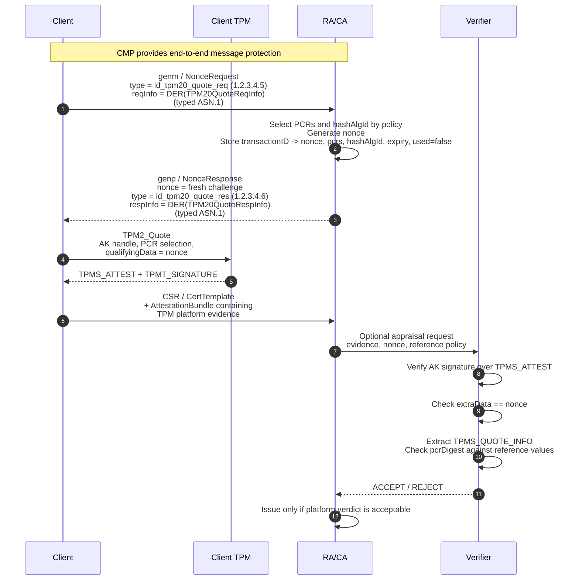

<!--
SPDX-FileCopyrightText: Copyright 2026 Siemens AG
SPDX-License-Identifier: Apache-2.0
-->

# TPM 2.0 Platform Attestation Design

Design notes and current wire-shape for a CMP-carried TPM 2.0 platform
attestation exchange between a **client / attester**, a **Relying Party / CA/RA**,
and an optional external **Verifier**.

This document describes the current platform-attestation profile in this
repository after the attestation-freshness ASN.1 redesign. It intentionally uses
the latest generic nonce-exchange shape:

- `NonceRequest` carries `len`, `type`, and optional type-specific `reqInfo`.
- `NonceResponse` carries `nonce`, `expiry`, `type`, and optional type-specific
  `respInfo`.
- The old `challengeParams` / `responseParams` `SEQUENCE OF ChallengeParam`
  design is no longer used.

The platform-attestation flow is separate from the key-attestation
proof-of-possession flow described in `KeyAttestResp_validated_v4.md`. The
platform flow proves freshness and PCR/reference-state validity of the platform;
it does not prove possession of a newly requested certificate private key.

## Workflow overview

The current platform flow is a nonce-bound `TPM2_Quote` design:

1. The **client** requests a platform-attestation nonce from the CA/RA. It may
   also propose TPM quote parameters, such as the hash algorithm, using
   `NonceRequest.reqInfo`.
2. The **CA/RA** selects the PCR set and hash algorithm required by policy. It
   returns a fresh nonce in `NonceResponse.nonce` and can return the selected
   TPM quote parameters in `NonceResponse.respInfo`.
3. The **client TPM** runs `TPM2_Quote` with an Attestation Key (AK), the selected
   PCRs, and `qualifyingData = NonceResponse.nonce`.
4. The **client** submits a CSR / `CertTemplate` containing an
   `AttestationBundle` with the TPM platform evidence.
5. The **CA/RA** either verifies the platform evidence itself or forwards it to
   an external Verifier.
6. The **Verifier** validates the AK signature, extracts `TPMS_QUOTE_INFO`,
   checks that `TPMS_ATTEST.extraData` equals the CA/RA nonce, and appraises
   `TPMS_QUOTE_INFO.pcrDigest` against reference values for the selected PCRs.
7. The **CA/RA** issues only if the CSR is otherwise valid and the platform
   attestation result is acceptable.



## CMP certificate-request workflow (general messages)

The nonce exchange is carried in CMP general messages:

- `genm` (`GenMsgContent`, client -> server), and
- `genp` (`GenRepContent`, server -> client).

Both are `SEQUENCE OF InfoTypeAndValue` containers. The freshness draft defines
`id-it-nonceRequest` and `id-it-nonceResponse` as the CMP `infoType` OIDs for
these payloads. The repository still uses private placeholder arcs until final
IANA values are assigned:

```asn1
-- Placeholder values used by the prototype. Replace with registered OIDs for
-- interoperability use.
id-it-nonceRequest  OBJECT IDENTIFIER ::= { 1 2 840 113549 1 9 16 2 8888 }
id-it-nonceResponse OBJECT IDENTIFIER ::= { 1 2 840 113549 1 9 16 2 8889 }
```

Note: the freshness draft registers the final OIDs under the CMP `id-it` arc
(`1.3.6.1.5.5.7.4`, values TBD1/TBD2 pending IANA), not under the S/MIME arc
used by these private placeholders. Once IANA assigns the values, switch to
the registered `id-it` OIDs.

The current generic ASN.1 freshness structures are:

```asn1
ATTESTATION-NONCE-REQUEST ::= TYPE-IDENTIFIER
AttestationNonceRequestSet ATTESTATION-NONCE-REQUEST ::= {
   ... -- None defined in this document --
}

ATTESTATION-NONCE-RESPONSE ::= TYPE-IDENTIFIER
AttestationNonceResponseSet ATTESTATION-NONCE-RESPONSE ::= {
   ... -- None defined in this document --
}

NonceRequest ::= SEQUENCE {
   len INTEGER (8..64) OPTIONAL,
   -- Indicates the required length of the requested nonce
   type ATTESTATION-NONCE-REQUEST.&id(
      {AttestationNonceRequestSet}) OPTIONAL,
   -- Identifies the nonce-request syntax for the
   --   selected Attestation statement type
   reqInfo ATTESTATION-NONCE-REQUEST.&Type(
      {AttestationNonceRequestSet}{@type}) OPTIONAL
   -- Contains type-specific nonce-request information
}

NonceResponse ::= SEQUENCE {
   nonce OCTET STRING (SIZE(0 | 8..64)),
   -- Contains the nonce of length len. A zero-length value means that
   -- the RA/CA does not require a freshness proof for the upcoming
   -- certificate request. An RA/CA that is unable or unwilling to provide
   -- a nonce signals this as a protocol error (e.g. CMP PKIFailureInfo)
   -- instead of returning an empty nonce.
   expiry INTEGER OPTIONAL,
   -- Indicates how long in seconds the nonce issuer considers the nonce valid
   type ATTESTATION-NONCE-RESPONSE.&id(
      {AttestationNonceResponseSet}) OPTIONAL,
   -- Identifies the nonce-response syntax for the
   --   selected Attestation statement type
   respInfo ATTESTATION-NONCE-RESPONSE.&Type(
      {AttestationNonceResponseSet}{@type}) OPTIONAL
   -- Contains type-specific nonce-response information
}
```

For this TPM platform profile, the request and response use distinct typed
ASN.1 structures and distinct example OIDs owned by
`libattest.formats.tpm.quote_profile`:

```text
id_tpm20_quote_req = 1.2.3.4.5
id_tpm20_quote_res = 1.2.3.4.6
```

A typical platform nonce exchange is:

```text
genm / NonceRequest:
  len     = 32
  type    = id_tpm20_quote_req (1.2.3.4.5)
  reqInfo = DER(TPM20QuoteReqInfo {
               certificateName: ["ak"],
               supportedHashAlgo: [0x000B]
             })

CA/RA pending state:
  transactionID -> nonce, pcrs, hashAlgId, expiry, used=false

genp / NonceResponse:
  nonce    = caNonce
  expiry   = validity period in seconds
  type     = id_tpm20_quote_res (1.2.3.4.6)
  respInfo = DER(TPM20QuoteRespInfo {
               pcrSelection: [0, 1, 2, 3, 4],
               hashAlgo: 0x000B
             })
```

The `nonce` field is the actual freshness challenge used as
`TPM2_Quote.qualifyingData`. TPM quote parameters are not overloaded into
`nonce`; they are carried in `reqInfo` and `respInfo`.

## TPM quote parameter structures

The request and response OIDs select different open-type structures:

```asn1
TPM20QuoteReqInfo ::= SEQUENCE {
    certificateName   SEQUENCE OF UTF8String OPTIONAL,
    supportedHashAlgo SEQUENCE OF INTEGER OPTIONAL
}

TPM20QuoteRespInfo ::= SEQUENCE {
    certificateName UTF8String OPTIONAL,
    pcrSelection    SEQUENCE OF INTEGER,
    hashAlgo        INTEGER
}
```

The Python implementation and DER codecs live in
`libattest.formats.tpm.quote_profile`.

Use in the two directions:

```text
Client -> CA/RA (propose only the hash bank):
  reqInfo = DER(TPM20QuoteReqInfo { supportedHashAlgo: [0x000B] })

CA/RA -> Client (select PCRs and hash by policy):
  respInfo = DER(TPM20QuoteRespInfo { pcrSelection: [0,1,2,3,4],
                                      hashAlgo: 0x000B })
```

The client MUST apply `respInfo` when invoking `TPM2_Quote`. If `respInfo` is
absent, PCR selection and hash algorithm are local policy / profile decisions;
that mode is less explicit and is not preferred for interoperable testing.

The typed request and response forms are used because the C client would
otherwise need a JSON parser (OpenSSL provides none) and because the integer
PCR values parse directly into the TPM selection bitmask.

A RATS Conceptual Message Wrapper (CMW, draft-ietf-rats-msg-wrap) is *not*
used for reqInfo/respInfo: quote-parameter negotiation is not a RATS
conceptual message (no `ind` bit applies), and the freshness draft suggests
CMW there only when multiple respInfo structures are required in a single
exchange. This profile instead issues one nonce exchange per attestation type.

The actual PCR values and PCR digest are not transported in `reqInfo` or
`respInfo`. They are produced by `TPM2_Quote` and carried in the later Evidence
inside `TPMS_QUOTE_INFO.pcrSelect` and `TPMS_QUOTE_INFO.pcrDigest`.

## Platform evidence carried in the CSR

After receiving the nonce and parameters, the client obtains platform evidence
from the TPM. Conceptually, the evidence contains:

```asn1
-- Conceptual only. The current repository treats Veraison TPM platform
-- evidence as an opaque payload with media type application/vnd.tcg.platform.
-- If the evidence is carried in an AttestationBundle, use the statement OID
-- selected for TPM platform / quote evidence and put the payload in stmt.
TpmPlatformEvidence ::= SEQUENCE {
    tpmSAttest      OCTET STRING,  -- raw TPMS_ATTEST returned by TPM2_Quote
    signature       OCTET STRING,  -- raw TPMT_SIGNATURE over tpmSAttest
    akCertChain     SEQUENCE OF Certificate OPTIONAL,
    pcrValues       OCTET STRING OPTIONAL
}
```

The repository's verifier-facing class for this profile is
`TpmPlatformVerifier`, whose expected media type is:

```text
application/vnd.tcg.platform
```

`TpmPlatformVerifier` currently delegates the submitted evidence bytes to a
`VerifierReferenceHandler`. This keeps the library independent from one concrete
Veraison evidence encoding. The reference handler owns the exact parsing and
comparison logic for the deployment. The lower-level helpers in
`libattest.formats.tpm.tpms_attest` can parse the TPM-native `TPMS_ATTEST`
fields when a handler has direct access to the raw quote structure.

When the evidence is embedded in the CSR attestation extension, the generic CSR
attestation container is:

```asn1
AttestationStatement ::= SEQUENCE {
    type   OBJECT IDENTIFIER,
    stmt   ANY
}

-- csr-attestation-27 constrains certs to CertificateChoices limited to the
-- X.509 'certificate' and 'other' alternatives (RFC 6268). For pure X.509
-- chains the DER is identical to SEQUENCE OF Certificate, but the declared
-- type also admits non-X.509 attestation certificate formats.
LimitedCertChoices ::= CertificateChoices
    (WITH COMPONENTS {certificate, other})

AttestationBundle ::= SEQUENCE {
    attestations   SEQUENCE SIZE (1..MAX) OF AttestationStatement,
    certs          SEQUENCE SIZE (1..MAX) OF LimitedCertChoices OPTIONAL
}
```

The bundle attaches to a PKCS#10 CSR as an attribute (or to a CRMF
CertTemplate as an extension) identified by `id-aa-attestation`
(`1.2.840.113549.1.9.16.2.59`; previously registered as `id-aa-evidence`,
renamed by draft -27 with the same OID value). Draft -27 has no `hint` field;
routing between verifiers is done by assigning distinct statement-type OIDs.

For opaque Veraison TPM platform evidence, `stmt` is normally a DER-wrapped
`OCTET STRING` containing the platform evidence bytes. For an already-DER ASN.1
statement, `stmt` can contain the DER value directly.

## TPM2_Quote details

The platform attestation statement is based on `TPM2_Quote`:

```text
TPM2_Quote(
    signHandle       = AK,
    qualifyingData   = NonceResponse.nonce,
    inScheme         = AK-compatible signing scheme,
    PCRselect        = pcrSelection / hashAlgo from TPM20QuoteRespInfo
) -> quoted: TPMS_ATTEST, signature: TPMT_SIGNATURE
```

The important freshness field is `TPMS_ATTEST.extraData`. For a quote,
`extraData` contains the `qualifyingData` passed to `TPM2_Quote`. The verifier
MUST compare it byte-for-byte with the nonce issued by the CA/RA for the
protected CMP transaction.

The relevant TPM-native structures are not ASN.1. They are TPM-marshalled
binary structures using big-endian integers and TPM-specific sized buffers.
They are shown here only to clarify the content inspected by the verifier.

```c
/* Common TPMS_ATTEST header and body. The attested union is selected by type.
   For TPM2_Quote, type is TPM_ST_ATTEST_QUOTE (0x8018). */
typedef struct {
    TPM_GENERATED       magic;           /* 0xff544347 */
    TPMI_ST_ATTEST      type;            /* quote => 0x8018 */
    TPM2B_NAME          qualifiedSigner; /* AK name */
    TPM2B_DATA          extraData;       /* qualifyingData / nonce */
    TPMS_CLOCK_INFO     clockInfo;
    UINT64              firmwareVersion;
    TPMU_ATTEST         attested;        /* TPMS_QUOTE_INFO for quotes */
} TPMS_ATTEST;

/* Attested union arm for TPM2_Quote. */
typedef struct {
    TPML_PCR_SELECTION  pcrSelect;
    TPM2B_DIGEST        pcrDigest;
} TPMS_QUOTE_INFO;

/* A PCR selection list. */
typedef struct {
    UINT32              count;
    TPMS_PCR_SELECTION  pcrSelections[count];
} TPML_PCR_SELECTION;

typedef struct {
    TPMI_ALG_HASH       hash;            /* e.g. 0x000B for SHA-256 */
    BYTE                sizeofSelect;
    BYTE                pcrSelect[sizeofSelect];
} TPMS_PCR_SELECTION;

/* The signature returned by TPM2_Quote. The concrete union arm is selected by
   sigAlg and the AK type/scheme. */
typedef struct {
    TPMI_ALG_SIG_SCHEME sigAlg;
    TPMU_SIGNATURE      signature;
} TPMT_SIGNATURE;
```

The helper `extract_qualifying_data(tpm_s_attest)` returns `extraData`.
The helper `extract_quote_info(tpm_s_attest)` returns:

```text
(pcrSelections, pcrDigest)
```

where `pcrDigest` is the `TPM2B_DIGEST` contained in `TPMS_QUOTE_INFO`.

## PCR reference-value appraisal

The verifier appraises the quote by comparing the quoted PCR digest against
reference values. The repository's format-agnostic reference structure is:

```json
{
  "description": "Golden boot state — firmware v1.2, kernel 6.1",
  "expected_pcr_digest_hex": "aabbcc..."
}
```

The direct check implemented by `verify_pcr_quote()` is:

```text
VERIFY-PCR-QUOTE
  1. Extract TPMS_QUOTE_INFO.pcrSelect from TPMS_ATTEST.
  2. Extract TPMS_QUOTE_INFO.pcrDigest from TPMS_ATTEST.
  3. Load the trusted PcrReferenceValues for the selected platform/profile.
  4. Compare pcrDigest byte-for-byte to expected_pcr_digest_hex.
  5. Return ACCEPT only on exact match.
```

For the simulator stack, the default PCR selection is:

```text
sha256:0,1,2,3,4
```

After `TPM2_Startup(CLEAR)`, the TCG simulator initializes SHA-256 PCRs to zero.
For PCRs 0..4 the deterministic reset digest is:

```text
pcrDigest = SHA-256(0x00 * 160)
          = b393978842a0fa3d3e1470196f098f473f9678e72463cb65ec4ab5581856c2e4
```

This simulator value is useful for tests only. Real hardware must be baselined
per platform, firmware, boot chain, operating system, and PCR policy.

## Verifier checks

A verifier that performs full TPM platform appraisal should perform at least the
following checks:

```text
VERIFY-TPM-PLATFORM
  1. Locate the pending nonce state using protected CMP transaction context.
  2. Ensure the nonce has not expired and has not already been used.
  3. Parse the platform evidence format selected by the AttestationStatement
     type and media type.
  4. Extract TPMS_ATTEST and TPMT_SIGNATURE.
  5. Validate the AK certificate chain / AK trust anchor according to policy.
  6. Verify TPMT_SIGNATURE over TPMS_ATTEST using the AK public key.
  7. Check TPMS_ATTEST.magic == TPM_GENERATED_VALUE (0xff544347).
  8. Check TPMS_ATTEST.type == TPM_ST_ATTEST_QUOTE (0x8018).
  9. Check TPMS_ATTEST.extraData == stored nonce.
 10. Extract TPMS_QUOTE_INFO.pcrSelect and pcrDigest.
 11. Check pcrSelect is the policy-selected PCR set and hash algorithm.
 12. Compare pcrDigest to trusted PCR reference values.
 13. Mark the nonce as used if the quote is accepted.
```

The CA/RA can perform these checks directly, or it can send the evidence and
nonce to an external Verifier and consume the returned Attestation Result. If the
Verifier is external, the CA/RA still owns the certificate issuance decision.

## Relationship to key attestation

Platform attestation and key attestation answer different questions:

- **Platform attestation** answers: "Was this platform in an approved measured
  state when it produced fresh evidence for this transaction?"
- **Key attestation / PoP** answers: "Is the requested certificate public key
  associated with a TPM-resident private key that completed the activation
  challenge?"

A certificate profile can require either or both. If both are required, the CA/RA
MUST bind both results to the same protected CMP transaction and issue only if
both the key-attestation proof and the platform-attestation quote are accepted.

## Security notes

### Freshness and replay protection

The CA/RA MUST generate a fresh nonce for every transaction, store it with
expiry and single-use state, and reject reused or expired quotes. The nonce MUST
be checked against `TPMS_ATTEST.extraData`, not merely against an outer transport
field.

### PCR reference quality

PCR digest comparison is only as strong as the reference values. A simulator
reset digest proves that the simulator is in its deterministic clean state; it
is not a production trust anchor. Production deployments need reference values
built from known-good firmware, bootloader, kernel, initrd, and runtime
measurement policy.

### AK and certificate policy

The quote signature proves possession of the AK private key, not the identity of
that AK by itself. The verifier must validate the AK certificate or other AK
trust evidence according to local policy and must ensure the AK is authorized for
platform quotes.

### Relay considerations

Per-transaction nonce material prevents replay of old quotes. It does not, by
itself, prevent a live relay where an attacker forwards the current nonce to a
genuine platform and relays the quote. This profile relies on CMP message
protection, authenticated enrollment channels, AK/EK policy, and deployment
identity checks to reduce that risk. If this flow is reused outside protected
CMP, the quote challenge should be bound to a transcript hash or channel-bound
context rather than a bare nonce alone.
